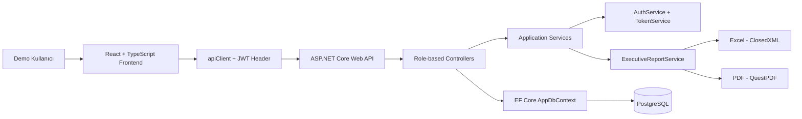

# TechOps O&M Yönetim Paneli

TechOps O&M; teknik tesis operasyonlarını, arıza kayıtlarını, planlı bakım süreçlerini, periyodik testleri, vardiya devirlerini, ekipman geçmişini ve yönetici raporlarını tek panelde toplayan kurumsal MVP projesidir.

Proje ASP.NET Core Web API, PostgreSQL, Entity Framework Core, React, TypeScript, Vite ve Tailwind CSS ile geliştirilmiştir. Demo verisi sunum senaryosu için hazırlanmıştır ve Excel/PDF yönetici raporları üretir.

## Öne Çıkanlar

| Alan | Kapsam |
|---|---|
| Operasyon dashboard | KPI kartları, arıza trendi, kritik arızalar, vardiya açık işleri, operasyon sağlığı |
| Arıza yönetimi | Kayıt oluşturma, atama, işlem notu, durum güncelleme, çözme, kapatma |
| Varlık yönetimi | Lokasyon, teknik sistem, ekipman listesi, ekipman detayı, operasyon geçmişi |
| Bakım yönetimi | Plan oluşturma, bakım başlatma, tamamlama, checklist ve bakım geçmişi |
| Periyodik testler | Test planı, test kaydı, sonuç takibi, ekipman bazlı test geçmişi |
| Vardiya devir teslim | Açık arıza/bakım devri, manuel kritik not, vardiya kayıtları |
| Raporlama | Filtreli operasyon analizi, tekrarlayan arıza, KPI ve tablo raporları |
| Yönetici çıktıları | Excel ve PDF rapor üretimi, tarih-saat damgalı dosya adları |
| Bildirim ve aktivite | Okundu/okunmadı bildirimler, audit log görünürlüğü |
| Kullanıcı yönetimi | Rol bazlı kullanıcı listesi, aktiflik yönetimi, kullanıcı iş yükü |

## Teknoloji Stack

| Katman | Teknoloji |
|---|---|
| Backend | ASP.NET Core Web API, .NET 9 |
| ORM | Entity Framework Core |
| Database | PostgreSQL |
| Auth | JWT Bearer Authentication, role-based authorization |
| Frontend | React, TypeScript, Vite |
| Stil | Tailwind CSS, Material Symbols, kurumsal koyu/açık panel dili |
| Rapor | ClosedXML, QuestPDF |
| Container | Docker, Docker Compose, nginx |
| Test | ASP.NET Core WebApplicationFactory integration tests |
| Lint | oxlint |

## Mimari



Mimari ayrım portföyde özellikle gösterilecek şekilde düzenlenmiştir:

| Katman | Sorumluluk |
|---|---|
| Controllers | HTTP request/response, model binding, role authorization, status code üretimi |
| Services | Kimlik doğrulama akışı, JWT üretimi, şifre doğrulama, Excel/PDF rapor üretimi |
| Data | EF Core ilişki konfigürasyonu, indexler, delete behavior, seed data ve migration geçmişi |
| Models/DTO | API response/request kontratları ve rapor doküman modelleri |

EF Core tarafında `AppDbContext`; kullanıcı-rol, lokasyon-ekipman, ekipman-arıza, bakım, test, vardiya ve audit/bildirim ilişkilerini explicit foreign key ve delete behavior ayarlarıyla tanımlar. Bu yapı Swagger, migration dosyaları ve integration testler üzerinden gösterilebilir.

## Hızlı Başlatma

Windows üzerinde günlük demo çalıştırması için:

```powershell
stajproject\projeyi-ac.bat
```

Bu dosya backend API'yi `http://localhost:5162`, frontend'i `http://127.0.0.1:5173` üzerinde başlatır ve tarayıcıyı açar.

Projeyi kapatmak için:

```powershell
stajproject\projeyi-kapat.bat
```

## Docker İle Çalıştırma

Docker gereksinimi olan ilanlar için proje full-stack compose dosyasıyla gelir:

Windows batch ile başlatmak için:

```powershell
stajproject\docker-ac.bat
```

Manuel Docker Compose komutu:

```powershell
docker compose up --build
```

Compose ile başlayan servisler:

| Servis | Container | Host URL/Port |
|---|---|---|
| Frontend | `techops-frontend` | `http://localhost:5173` |
| API | `techops-api` | `http://localhost:5162` |
| PostgreSQL | `techops-postgres` | `localhost:5433` |

Backend container `TechOps__ApplyMigrationsOnStartup=true` ile başlar; PostgreSQL hazır olduğunda EF Core migration'ları uygular ve seed veriyi oluşturur.

Kapatmak için:

```powershell
stajproject\docker-kapat.bat
```

Manuel komut:

```powershell
docker compose down
```

Veri volume'unu da sıfırlamak için:

```powershell
docker compose down -v
```

Windows batch ile volume dahil sıfırlamak için:

```powershell
stajproject\docker-kapat.bat -v
```

## İlk Kurulum

Gereksinimler:

| Araç | Sürüm |
|---|---|
| .NET SDK | 9.x |
| Node.js | 20.x veya üstü önerilir |
| PostgreSQL | Local PostgreSQL kurulumu |
| npm | Node ile gelen sürüm yeterlidir |

Backend paketleri ve veritabanı:

```powershell
cd stajproject\back
dotnet tool restore
cd TechOps.Api
dotnet restore
dotnet ef database update
dotnet run --no-launch-profile --urls http://localhost:5162
```

Frontend paketleri:

```powershell
cd stajproject\front
npm install
$env:VITE_API_BASE_URL="http://localhost:5162"
npm run dev -- --host 127.0.0.1 --port 5173
```

Local URL'ler:

| Servis | URL |
|---|---|
| Frontend | `http://127.0.0.1:5173` |
| API | `http://localhost:5162` |
| Health | `http://localhost:5162/api/health` |
| Swagger | `http://localhost:5162/swagger/index.html` |

## Demo Giriş

| Alan | Değer |
|---|---|
| Kullanıcı adı | `admin` |
| Şifre | `Demo123!` |

Demo kullanıcılar seed data üzerinden oluşturulur. `appsettings.json` içindeki bağlantı ve JWT değerleri local geliştirme içindir; production ortamında environment variable veya user-secrets kullanılmalıdır.

## Sunum Akışı

1. Login ekranında ürün değer önerisini anlat.
2. Dashboard'da KPI kartları, kritik risk, bakım uygunluğu ve test güvenini göster.
3. Kritik arızadan arıza detayına geçip atama/durum akışını anlat.
4. Varlık yönetiminde ekipman geçmişi sekmeleriyle arıza, bakım, test ve vardiya ilişkisini göster.
5. Vardiya devir teslim ekranında açık işlerin sonraki vardiyaya aktarımını göster.
6. Raporlama ekranında filtreli operasyon analizi ve Excel/PDF export'u göster.
7. Bildirim ve aktivite merkezinde izlenebilirlik/audit log değerini göster.
8. Kullanıcı yönetiminde rol bazlı erişim ve kullanıcı iş yükünü göster.

Uygulama içinde üst bardaki `Sonraki Akış Adımı` butonu bu akışı hızlıca gezmek için eklenmiştir.

## LinkedIn ve Portföy Vitrini

Önerilen görsel carousel:

1. Dashboard: KPI, demo rehberi ve kritik risk görünümü.
2. Arıza Detayı: durum akışı, atama ve işlem geçmişi.
3. Ekipman Geçmişi: arıza, bakım, test ve vardiya ilişkisi.
4. Raporlama: filtreli analiz ve Excel/PDF butonları.
5. Mimari: React, ASP.NET Core, EF Core, PostgreSQL ve rapor servisi diyagramı.

Önerilen kısa paylaşım metni:

```text
TechOps O&M Yönetim Paneli MVP'sini tamamladım.

React + TypeScript frontend, ASP.NET Core Web API backend, PostgreSQL, JWT rol bazlı yetkilendirme, operasyon dashboard'u, arıza/bakım/test/vardiya modülleri ve Excel/PDF yönetici raporları içeriyor.

Odak noktam: teknik operasyon süreçlerini tek panelde izlenebilir, raporlanabilir ve sunuma hazır hale getirmekti.
```

Detaylı paylaşım taslağı için `LINKEDIN-PAYLASIM.md` dosyasına bakın.

## Kontrol Komutları

Backend build:

```powershell
cd stajproject\back\TechOps.Api
dotnet build "TechOps.Api.csproj" --no-restore -p:UseAppHost=false
```

Pending migration kontrolü:

```powershell
dotnet ef migrations has-pending-model-changes --no-build
```

Integration testler:

```powershell
cd stajproject\back
dotnet test "TechOpsManagementSystem.sln" -p:UseAppHost=false
```

Test kapsamı:

| Test | Gösterdiği Yetkinlik |
|---|---|
| Login integration | Gerçek HTTP pipeline, seed kullanıcı, JWT üretimi |
| Admin authorization | Anonymous `401`, non-admin role `403` doğrulaması |
| Export integration | Modül bazlı Excel endpointleri ve dosya adları |

Frontend build ve lint:

```powershell
cd stajproject\front
npm run build
npm run lint
```

## Kalite Durumu

Son doğrulamalarda backend build, frontend build, frontend lint, integration test, API health/login smoke ve Excel/PDF export smoke kontrolleri başarılı çalıştırılmıştır.

## Proje Yapısı

```text
stajproject/
  docker-compose.yml
  projeyi-ac.bat
  projeyi-kapat.bat
  docker-ac.bat
  docker-kapat.bat
  back/
    TechOpsManagementSystem.sln
    TechOps.Api/
      Dockerfile
      Controllers/
      Data/
      Entities/
      Enums/
      Migrations/
      Models/
      Security/
      Services/
    TechOps.Api.IntegrationTests/
  front/
    Dockerfile
    nginx.conf
    src/
      App.tsx
      DashboardView.tsx
      FaultsView.tsx
      EquipmentView.tsx
      MaintenanceView.tsx
      TestsView.tsx
      ShiftsView.tsx
      ReportsView.tsx
      NotificationsView.tsx
      UserManagementView.tsx
      apiClient.ts
      UiState.tsx
```

